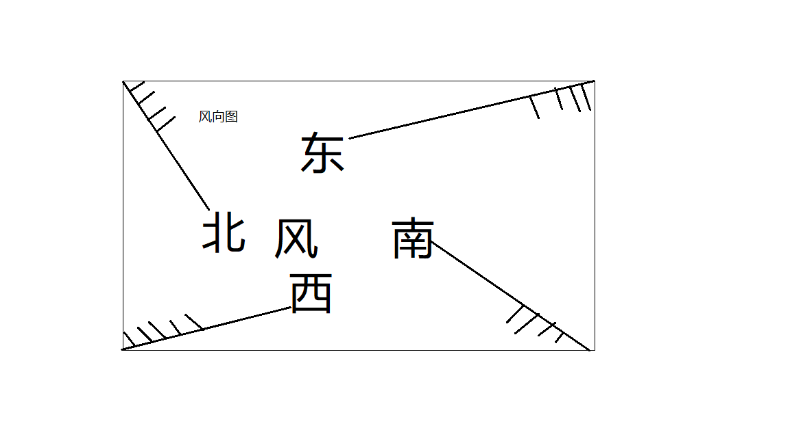
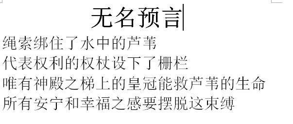
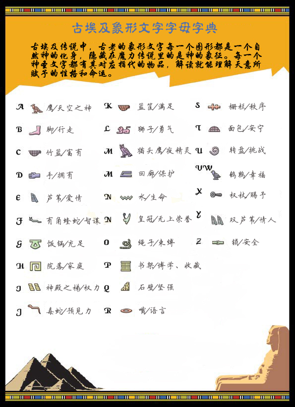
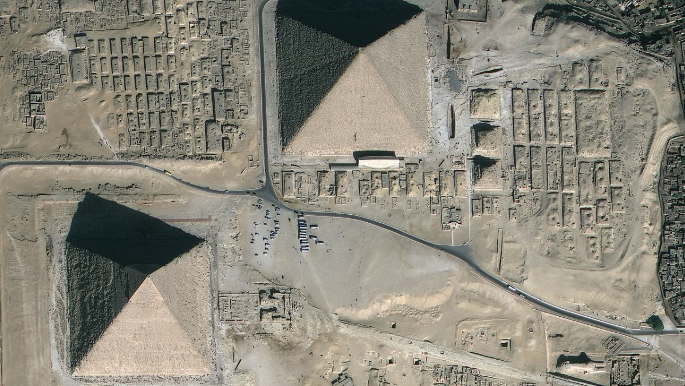
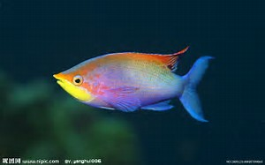
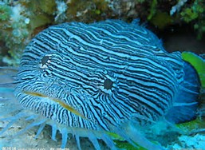
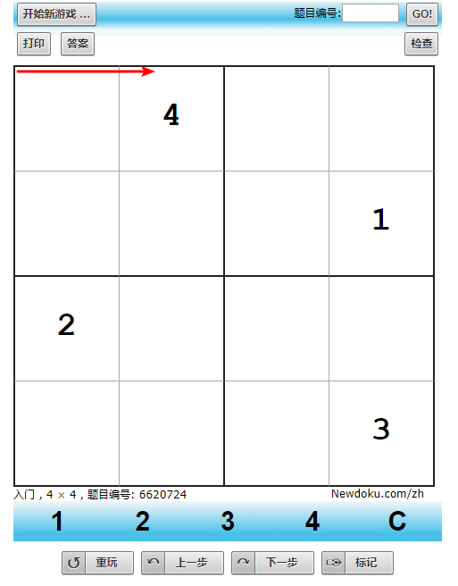
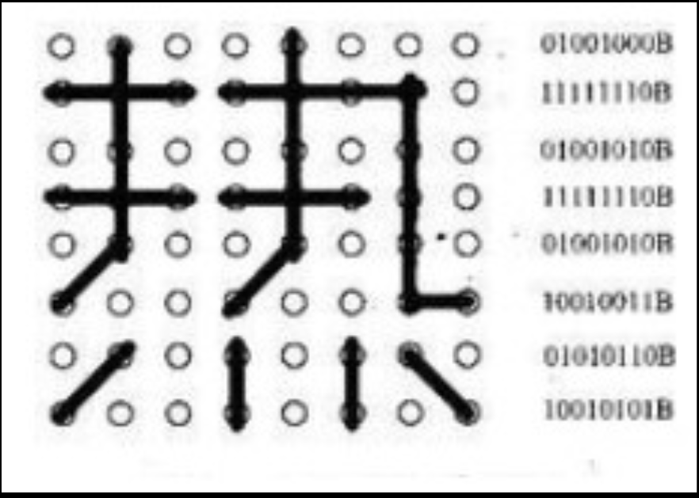

# 1. 密室逃脱

## 1.1. 场外介绍

名字是：幻境重重

四十大盗的宝藏被大魔王（也就是我）藏在一座城堡中，并布下了重重机关，阻止探险家的接近，这些机关是一系列的幻境组成，这些幻境即相互独立，又相互交织，希望探险家们能够突破重围，夺宝归来！

（集齐六个房间的钥匙，然后来到大魔王身边。）

## 1.2. 一楼大厅

### 1.2.1. 背景

探险家们乘船来到城堡所在的孤岛，然而刚出发就狂风大作，航海图也因此丢失，赶快靠岸吧！

### 1.2.2. 谜题

找到藏在大厅的航海图，也就是密码本，线索就是那张风向图

### 1.2.3. 干扰线索

无

### 1.2.4. 材料

背景介绍1，风向图1，航海图1。

### 1.2.5. 道具布局

把密码本，也就是航海图放到跟风有关的地方就行。放到厨房的拍风处，或者麻将的掷色子处。

## 1.3. 房间1-法老的预言

### 1.3.1. 背景

翻越金字塔，探险家们被一面墙挡住了去路，只见墙上展示了一个古老的预言，教授突然想起，哎呀，我的埃及字典掉进海里了！赶快回去找。

### 1.3.2. 谜题

根据字典和语言得到四个数字，按顺序从密码本中得到钥匙的地理位置。进而开启2号房间

### 1.3.3. 干扰线索

金字塔图片两张，一张作为原图，一张剪碎作为拼图，拼图背面写上“这是干扰线索”

### 1.3.4. 材料

背景材料1，法老预言1，埃及字典1，金字塔纸1

### 1.3.5. 道具布局

埃及字典需要到海洋中找，即到大厅去找

## 1.4. 房间2-海底世界

### 1.4.1. 背景

大魔王拥有随意制造任何幻境的力量，但是不要害怕，幻影终究是心灵的桎梏，探险家要做的就是突破自己的想象。可是周围一片黑暗，什么都看不到，等等，只能感受到奇形怪状的鱼。赶快解出心灵密码吧！

### 1.4.2. 谜题

四张鱼的海报，其实只要用荧光笔在上面写字即可，把窗帘拉起来，在黑暗情况下看上面的字，顺序即可。找到三号门的钥匙

### 1.4.3. 干扰线索

打印一张埃及的象形文字图吧

### 1.4.4. 材料

鱼海报4，象形文字图1，背景材料1

隐形荧光笔一个（带灯的那种）

### 1.4.5. 道具布局

这个主题需要房间能够完全黑暗

海报贴墙上，荧光笔放到海洋里面藏好。干扰项放床上。

## 1.5. 房间3-数码世界

### 1.5.1. 背景

才度过一个幻境就被图形符号弄晕菜了？振作起来，有一个迷幻矩阵在等着你！

### 1.5.2. 谜题

解数独即可，就看你速度有多快了，找到四号门的钥匙

但是解密只需要四个数字即可，这时候就要利用房间2的干扰项，那个象形文字了。把数独看成一个一维矩阵，索引即可。

### 1.5.3. 干扰线索

### 1.5.4. 材料

一张纸即可

### 1.5.5. 道具布局

贴墙上都行。

## 1.6. 房间4-奇妙的回声

### 1.6.1. 背景

这个幻境很有意思，貌似无声，却似有声。

### 1.6.2. 谜题

莫尔斯电码，找到5号门的钥匙

### 1.6.3. 干扰线索

无

### 1.6.4. 材料

一个莫尔斯电码本打印，一段声音发微信

### 1.6.5. 道具布局

莫尔斯电码本直接放床上吧

## 1.7. 房间5--击败大魔王

### 1.7.1. 背景

拿着这张符咒去找大魔王吧！

### 1.7.2. 谜题

所有房间的钥匙，到六号房间拿到大魔王最害怕的恐惧符号，然后来找我即可。

:blush::blush::blush::blush::blush::blush::blush::blush::blush::blush::blush::blush:
大魔王最害怕什么？ :blush::blush::blush::blush::blush:

:blush::blush::blush::blush::blush::blush::blush::blush::blush::blush::blush::blush:

### 1.7.3. 干扰线索

### 1.7.4. 材料

一张纸

### 1.7.5. 道具布局

## 1.8. 房间6-

### 1.8.1. 背景

### 1.8.2. 谜题

### 1.8.3. 干扰线索

### 1.8.4. 材料

### 1.8.5. 道具布局

## 1.9. 密码本设计

密码本是将数字和钥匙藏身位置联系起来的手册，所以要根据别墅实际情况设计，大家一起设计密码本（航海图）

如果设计不出有难度的，那么就设计一个上帝好了，密码记在笔记本上。

### 1.9.1. 一个例子

例子会写在密码本上。

首先会有四位数字，到密码本中查找，得到四个关键字，然后到对应地点去查.

## 1.10. 道具藏匿与提示

暂无